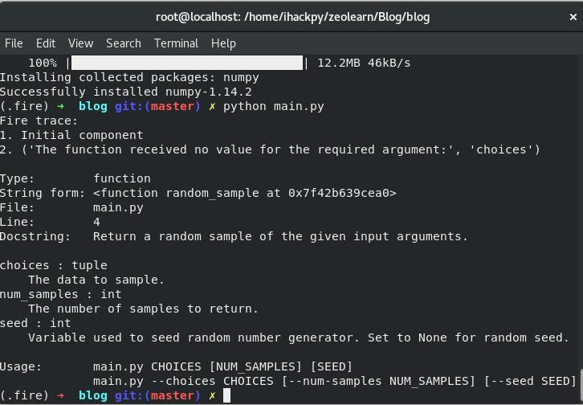

# Python Fire : Automatically Turn Your Code In To CLI
**Python Fire** is an Opensource library created by Google which automatically generates command line interface from any python object. It give power of developing and debugging any Python Code. 

Python Fire will work with a module, class, object, dict, list etc. CLIs generated by Python Fire is complete with automatic help pages, tab completion, and an interactive mode, and they stay up to date even as your code changes.

**Lets start with Python Fire**

## Installation

### Using Pip:
> pip install fire

### Using Conda:
> conda install fire -c conda-forge

### or , clone the source & run :
> python setup.py install

## Test a simple example
```
import fire

class calc(object):
	
	def square(self, number):
		return number**2

if __name__ == '__main__':
	fire.Fire(calc)

```
Open Your Terminal & Run,

> python calc.py square 4 # 16 

## How Google Uses Python Fire :
 Google Engineer uses Python Fire to generate command line tool from Python Library. We can see a lot    of simple apps that generates automated command line interfaces with the help of Python Fire library.   It helps us to spend less time in documentation inspite of Programming. After Tensorflow this is one    of the fantastic opensource library created by google.

## Why is it called Fire?

> When you call **Fire** , it fires off(executes) your command.

Lets take a look an example in which we make an app which generate random samples.
# Talk is cheap , Show me the Code
This example is taken from this superb [blog](https://medium.com/@galea/automated-python-arguments-with-google-fire-600ec602c58b) written by [Alex Galea](https://www.twitter.com/agalea91)
```
import fire
import numpy as np

def random_sample(choices, num_samples=1, seed=None):
    '''
    Return a random sample of the given input arguments.
    
    choices : tuple
        The data to sample.
    num_samples : int
        The number of samples to return.
    seed : int
        Variable used to seed random number generator. Set to None for random seed.
    '''
    num_samples = int(num_samples)
    seed = int(seed) if str(seed).isnumeric() else seed

    print('Choices: %s' % repr(choices))
    print('Genreating %d samples' % num_samples)
    print('Random seed: %r' % seed)
    np.random.seed(seed)
    samples = np.random.choice(choices, size=num_samples)
    print('Samples:')
    return '\n'.join(samples)

def main():
    fire.Fire(random_sample)

if __name__ == '__main__':
    main()
```
### Run python main.py 


Our random_sample function fed into **Fire** method.

# Basic Usage of Fire CLI :

1. Accessing Member of an object.
2. Accessing members of a dict
3. Accessing members of a list or tuple
4. Calling a function
5. Instantiating a class
Know more about Fire [Go To Official Docs](https://github.com/google/python-fire/blob/master/docs/using-cli.md)

### I will wrapped my words here with this awesome quote by Anthony J. D'Angelo :
> *without a sense of caring, there can be no sense of community.*

**Happy Coding!**
**Happy Coding**
